---
# Front matter
lang: ru-RU
title: "Лабораторная работа № 2"
subtitle: "Дискреционное разграничение прав в Linux. Основные атрибуты"
author: "Абдуллаев Сайидазизхон Шухратович"

# Formatting
toc-title: "Содержание"
toc: true
toc_depth: 2
lof: true
lot: true
fontsize: 12pt
linestretch: 1.5
papersize: a4paper
documentclass: scrreprt
polyglossia-lang: russian
polyglossia-otherlangs: english
mainfont: PT Serif
romanfont: PT Serif
sansfont: PT Sans
monofont: PT Mono
mainfontoptions: Ligatures=TeX
romanfontoptions: Ligatures=TeX
sansfontoptions: Ligatures=TeX,Scale=MatchLowercase
monofontoptions: Scale=MatchLowercase
indent: true
pdf-engine: lualatex
header-includes:
  - \linepenalty=10
  - \interlinepenalty=0
  - \hyphenpenalty=50
  - \exhyphenpenalty=50
  - \binoppenalty=700
  - \relpenalty=500
  - \clubpenalty=150
  - \widowpenalty=150
  - \displaywidowpenalty=50
  - \brokenpenalty=100
  - \predisplaypenalty=10000
  - \postdisplaypenalty=0
  - \floatingpenalty = 20000
  - \raggedbottom
  - \usepackage{float}
  - \floatplacement{figure}{H}
---

# Цель работы

Получение практических навыков работы в консоли с атрибутами файлов, закрепление теоретических основ дискреционного разграничения доступа в современных системах с открытым кодом на базе.

# Задание

Закрепить дискреционное разграничение прав в Linux.

# Теоретическое введение

В Linux, как и в любой многопользовательской системе, абсолютно естественным образом возникает задача разграничения доступа субъектов — пользователей к объектам — файлам дерева каталогов. Один из подходов к разграничению доступа — так называемый дискреционный - предполагает назначение владельцев объектов, которые по собственному усмотрению определяют права доступа субъектов (других пользователей) к объектам (файлам), которыми владеют. Дискреционные механизмы разграничения доступа используются для разграничения прав доступа процессов как обычных пользователей, так и для ограничения прав системных программ в (например, служб операционной системы), которые работают от лица псевдопользовательских учетных записей. Чтобы получить доступ к файлам в Linux, используются разрешения. Эти разрешения назначаются трем объектам: файлу, группе и другому объекту. Для управления правами используется команда chmod. При использовании chmod в относительном режиме вы работаете с тремя индикаторами, чтобы указать, что вы хотите сделать. Сначала вы указываете, для кого вы хотите изменить разрешения. Для этого вы можете выбрать между пользователем (u), группой (g) и другими (o). Затем вы используете оператор для добавления или удаления разрешений из текущего режима или устанавливаете их абсолютно. В конце вы используете r(read), w(write) и x(execute), чтобы указать, какие разрешения вы хотите установить.При использовании chmod вы можете устанавливать разрешения для пользователя (user), группы (group) и других (other).Помимо основных разрешений, о которых вы только что прочитали, в Linux также есть набор расширенных разрешений. Это не те разрешения, которые вы устанавливаете по умолчанию, но иногда они предоставляют полезное дополнение.

# Ход работы

1. В установленной при выполнении предыдущей лабораторной работы
операционной системе создаем учётную запись пользователя guest. (Рис. [-@fig:001]).

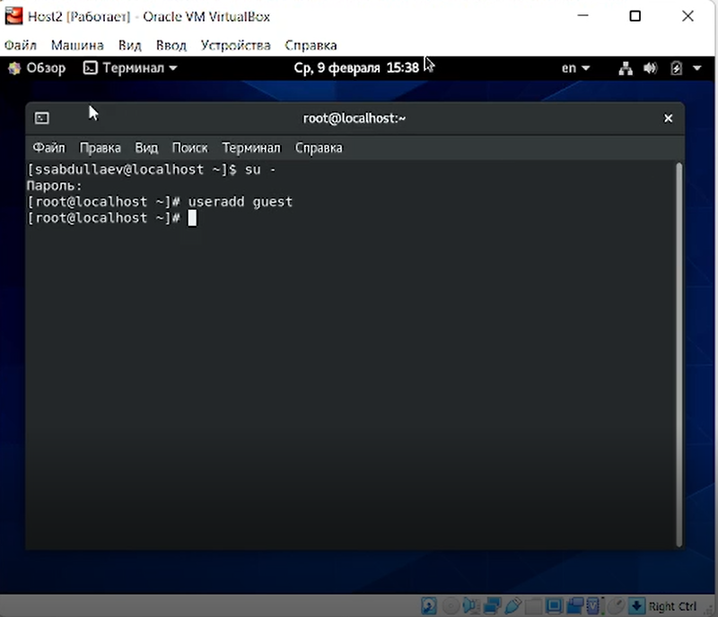{ #fig:001 width=73% }

2. Задаем пароль для пользователя guest (использую учётную запись администратора). (Рис. [-@fig:002]).

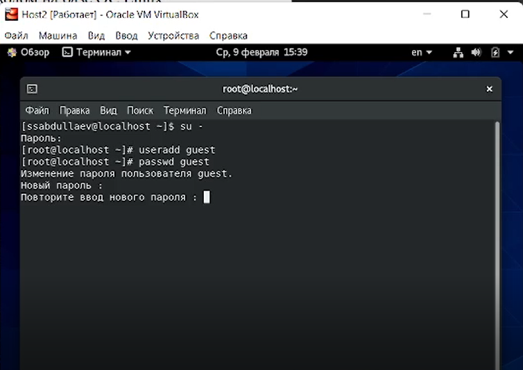{ #fig:002 width=73% }

3. Входим в в систему от имени пользователя guest и определяем директорию, в которой мы находимся. Как можно заметить, мы находимся в домашней директории, о чем свидетельствует значок тильды, а также результат введения команды pwd. (Рис. [-@fig:003], [-@fig:004]).

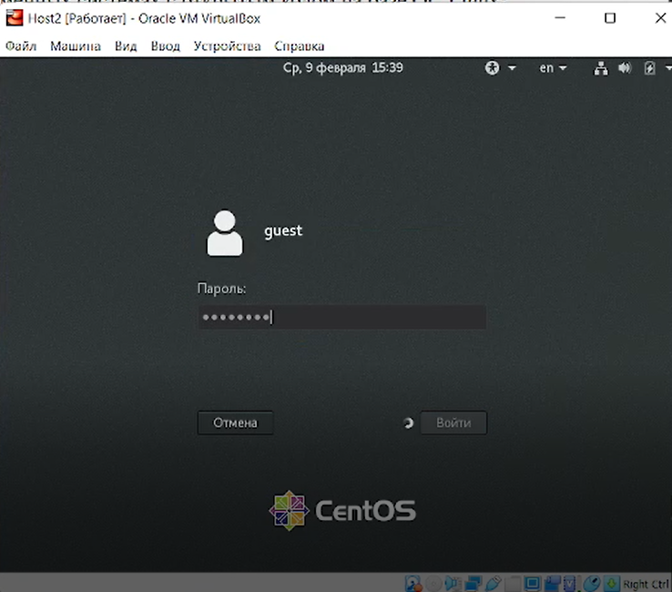{ #fig:003 width=73% }

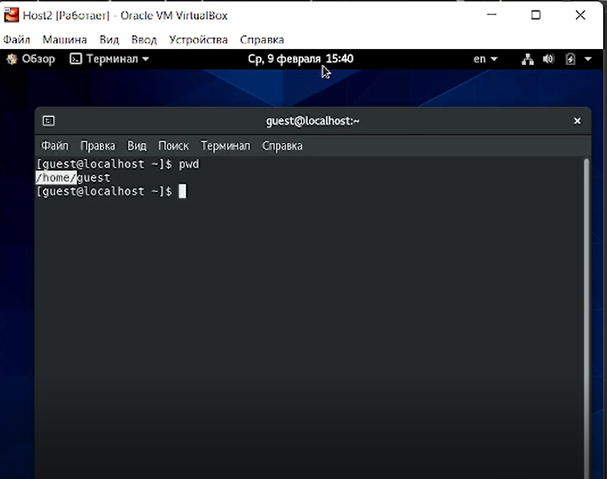{ #fig:004 width=73% }

4. Уточняем имя пользователя командой whoami. Уточняем его группу, а также группы, куда входит пользователь, командой id.Выведенные значения uid, gid сравниваем с выводом команды groups. Нетрудно заметить, что они совпадают. Кроме того, полученная информация совпадает с данными, выводимыми в приглашении командной строки. ([-@fig:006], [-@fig:007]).

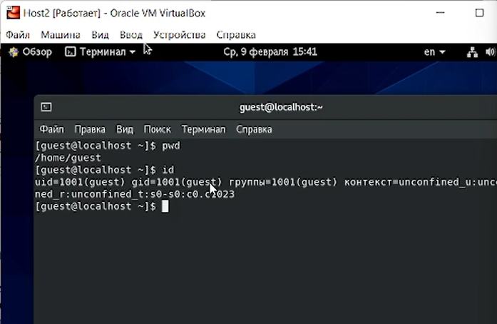{ #fig:006 width=73% }

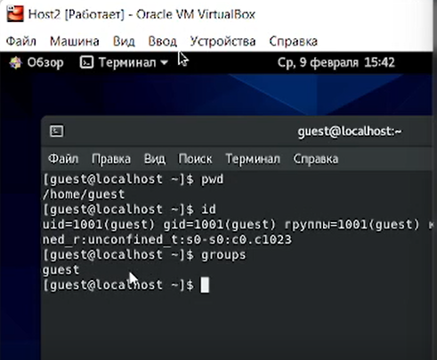{ #fig:007 width=73% }

5. Просматриваем файл /etc/passwd командой cat /etc/passwd. Найдя в нём свою учётную запись, определяем uid  и  gid пользователя. Значения совпадают с полученными в предыдущих пунктах. (Рис. [-@fig:009]).

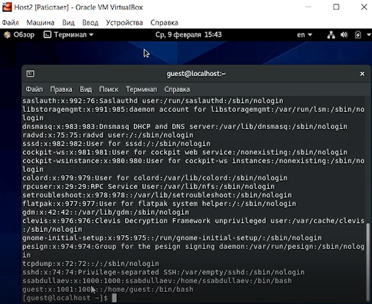{ #fig:009 width=73% }

6. Определяем существующие в системе директории командой ls -l /home/. В результате удалось получить список поддиректорий директории /home. На имеющихся директориях (avaksenova и guest) был установлен полный набор прав. (Рис. [-@fig:010]).

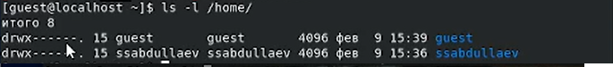{ #fig:010 width=73% }

7. Командой lsattr /home проверяем, какие расширенные атрибуты установлены на поддиректориях, находящихся в директории /home.Расширенные атрибуты директории avaksenova увидеть не удалось из-за нехватки прав доступа, а расширенные атрибуты директории guest отстутствуют. (Рис. [-@fig:011]). 

 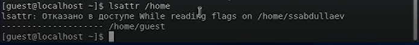{ #fig:011 width=73% } 

 8. Создаем в домашней директории поддиректорию dir1 командой mkdir dir1. Определяем командами ls -l и lsattr, какие права доступа и расширенные атрибуты были выставлены на директорию dir1, а затем снимаем с директории dir1 все атрибуты командой chmod 000 dir1 и проверяем правильность выполнения с помощью  ls -l. (Рис. [-@fig:012], [-@fig:013]).

 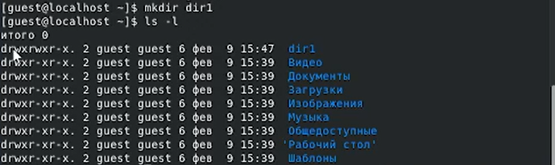{ #fig:012 width=73% }

 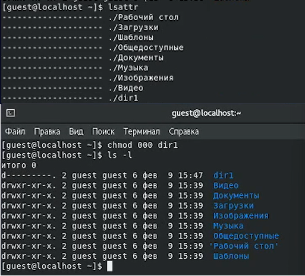{ #fig:013 width=73% }

 9. Пытаемся создать в директории dir1 файл file1 командой echo "test" > /home/guest/dir1/file1. В результате получаем отказ в выполнении операции по созданию файла, поскольку в предыдущих пунктах с директории dir1 были сняты все атрибуты. Таким образом, файл не создался, в чем убеждаемся, применив команду ls -l /home/guest/dir1. (Рис. [-@fig:014], [-@fig:015]).

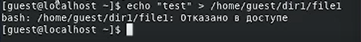{ #fig:014 width=73% }

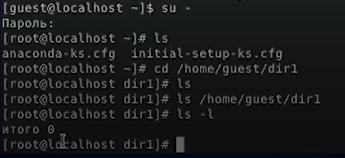{ #fig:015 width=73% }

10. Заполняем таблицу «Установленные права и разрешённые действия» , выполняя действия от имени владельца директории (файлов), определяем опытным путём, какие операции разрешены, а какие нет.Если операция разрешена, заносим в таблицу знак «+», если не разрешена, знак «-». При заполнении таблицы рассматриваем не все атрибуты файлов и директорий, а лишь «первые три»: г, w, х, для «владельца». В итоге рассматриваем 64 варианта. (Рис. [-@fig:016], [-@fig:017]).

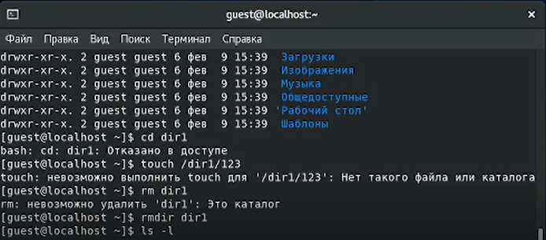{ #fig:016 width=73% }

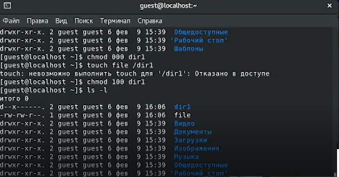{ #fig:016 width=73% }

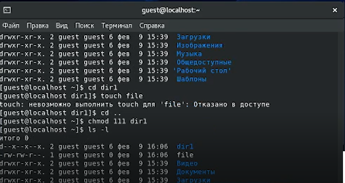{ #fig:016 width=73% }

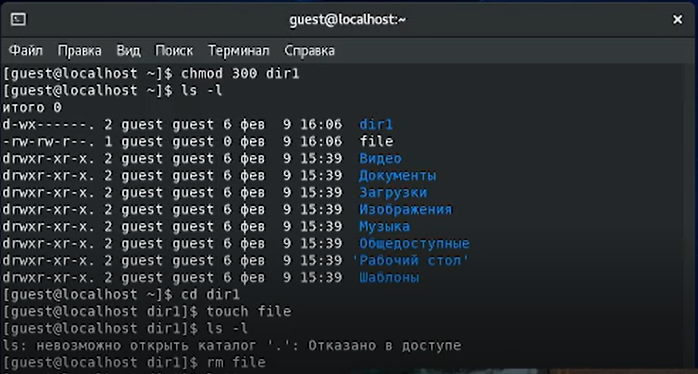{ #fig:016 width=73% }

{ #fig:017 width=73% }

11.  На основании заполненной таблицы определяем те или иные минимально необходимые права для выполнения операций внутри директории dir1, внося данные во вторую таблицу. (Рис. [-@fig:018]).

 { #fig:018 width=73% }

# Выводы

В результате выполнения данной работы были приобретены практические навыки работы в консоли с атрибутами файлов, закрепление теоретических основ дискреционного разграничения доступа в современных системах с открытым кодом на базе CentOs.
