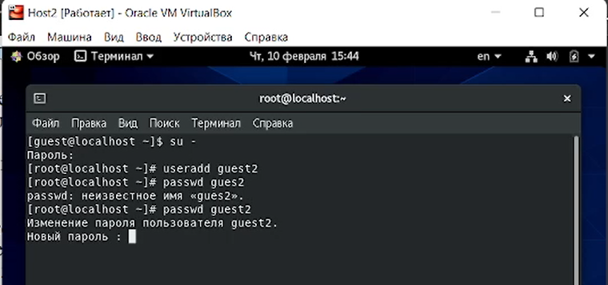
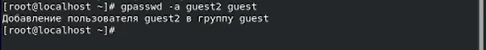
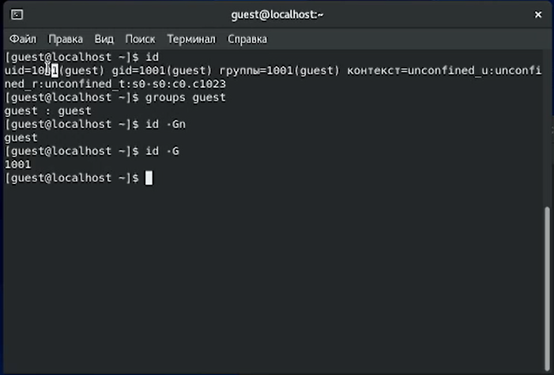
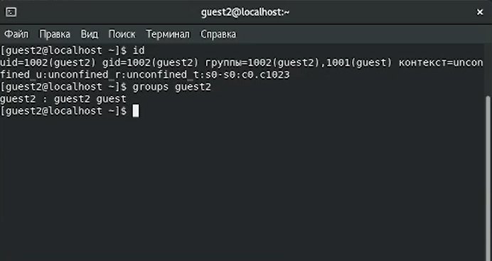
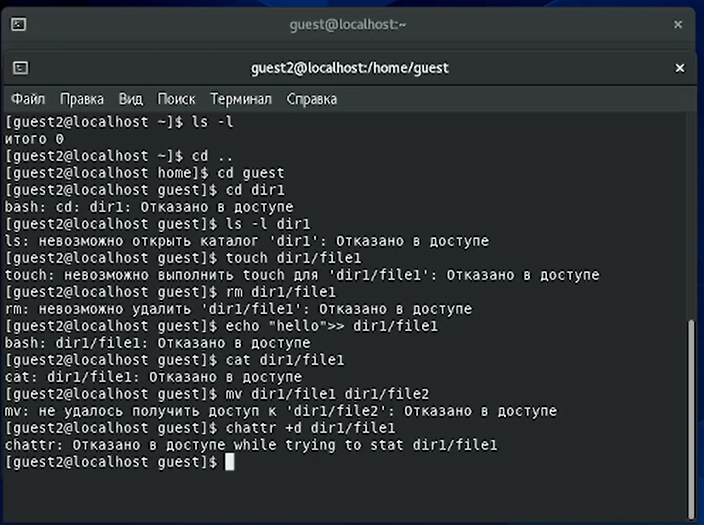

---
## Front matter
lang: ru-RU
title: "Лабораторная работа № 3"
subtitle: "Дискреционное разграничение прав в Linux. Два пользователя"
author: "Абдуллаев Сайидазизхон Шухратович"

## Formatting
toc: false
slide_level: 2
theme: metropolis
header-includes: 
 - \metroset{progressbar=frametitle,sectionpage=progressbar,numbering=fraction}
 - '\makeatletter'
 - '\beamer@ignorenonframefalse'
 - '\makeatother'
aspectratio: 43
section-titles: true
---

## Цель работы

Получение практических навыков работы в консоли с атрибутами файлов для групп пользователей

# Ход работы

## Создание новой учетной записи

{ #fig:001 width=100% }

## Добавление пользователя guest2 в группу guest

{ #fig:002 width=100% }

## Уточнение id пользователей

{ #fig:003 width=100% }

## Уточнение id пользователей
{ #fig:004 width=100% }

## Процесс проверки разрешенных операций

{ #fig:005 width=100% }

## Таблица "Установленные права и разрешённые действия""

{ #fig:006 width=72% }

## Проверка минимально необходимых прав для выполнения операций внутри директории

{ #fig:007 width=100% }

## Вывод

- В результате выполнения данной работы были приобретены практические навыки работы в консоли с атрибутами файлов для группы.