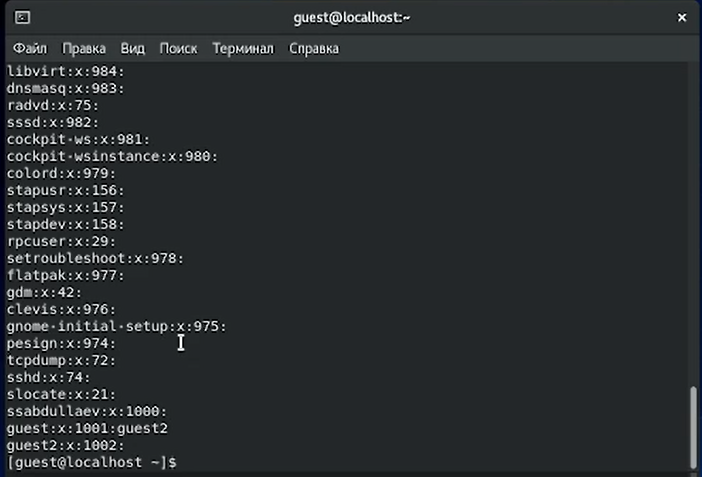
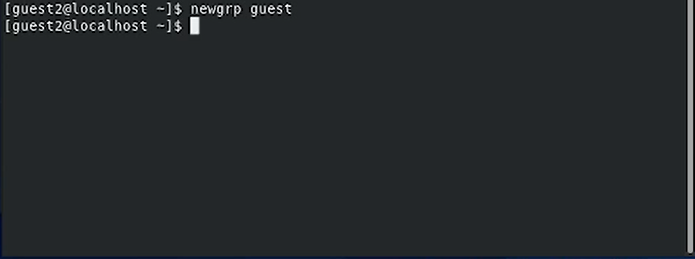

---
# Front matter
lang: ru-RU
title: "Лабораторная работа № 3"
subtitle: "Дискреционноеразграничение прав в Linux. Два пользователя"
author: "Абдуллаев Сайидазизхон Шухратович"

# Formatting
toc-title: "Содержание"
toc: true
toc_depth: 2
lof: true
lot: true
fontsize: 12pt
linestretch: 1.5
papersize: a4paper
documentclass: scrreprt
polyglossia-lang: russian
polyglossia-otherlangs: english
mainfont: PT Serif
romanfont: PT Serif
sansfont: PT Sans
monofont: PT Mono
mainfontoptions: Ligatures=TeX
romanfontoptions: Ligatures=TeX
sansfontoptions: Ligatures=TeX,Scale=MatchLowercase
monofontoptions: Scale=MatchLowercase
indent: true
pdf-engine: lualatex
header-includes:
  - \linepenalty=10
  - \interlinepenalty=0
  - \hyphenpenalty=50
  - \exhyphenpenalty=50
  - \binoppenalty=700
  - \relpenalty=500
  - \clubpenalty=150
  - \widowpenalty=150
  - \displaywidowpenalty=50
  - \brokenpenalty=100
  - \predisplaypenalty=10000
  - \postdisplaypenalty=0
  - \floatingpenalty = 20000
  - \raggedbottom
  - \usepackage{float}
  - \floatplacement{figure}{H}
---

# Цель работы

Получение практических навыков работы в консоли с атрибутами файлов для групп пользователей.

# Задание

Закрепить дискреционное разграничение прав для групп в Linux.

# Теоретическое введение

Linux в целом и Ubuntu в частности - системы многопользовательские, т.е. на одном компьютере может быть несколько различных пользователей, каждый со своими собственными настройками, данными и правами доступа к различным системным функциям.Кроме пользователей в Linux для разграничения прав существуют группы. Каждая группа так же как и отдельный пользователь обладает неким набором прав доступа к различным компонентам системы и каждый пользователь-член этой группы автоматически получает все права группы. То есть группы нужны для группировки пользователей по принципу одинаковых полномочий на какие-либо действия, вот такая тавтология. Каждый пользователь может состоять в неограниченном количестве групп и в каждой группе может быть сколько угодно пользователей1). Один из подходов к разграничению доступа — так называемый дискреционный - предполагает назначение владельцев объектов, которые по собственному усмотрению определяют права доступа субъектов (других пользователей) к объектам (файлам), которыми владеют. Дискреционные механизмы разграничения доступа используются для разграничения прав доступа процессов как обычных пользователей, так и для ограничения прав системных программ в (например, служб операционной системы), которые работают от лица псевдопользовательских учетных записей. Чтобы получить доступ к файлам в Linux, используются разрешения. Эти разрешения назначаются трем объектам: файлу, группе и другому объекту. Для управления правами используется команда chmod. При использовании chmod в относительном режиме вы работаете с тремя индикаторами, чтобы указать, что вы хотите сделать. Сначала вы указываете, для кого вы хотите изменить разрешения. Для этого вы можете выбрать между пользователем (u), группой (g) и другими (o). Затем вы используете оператор для добавления или удаления разрешений из текущего режима или устанавливаете их абсолютно. В конце вы используете r(read), w(write) и x(execute), чтобы указать, какие разрешения вы хотите установить.При использовании chmod вы можете устанавливать разрешения для пользователя (user), группы (group) и других (other).Помимо основных разрешений, о которых вы только что прочитали, в Linux также есть набор расширенных разрешений. Это не те разрешения, которые вы устанавливаете по умолчанию, но иногда они предоставляют полезное дополнение.

# Ход работы

1. Заходим под учётной записью пользователя guest, созданной при выполнении предыдущей лабораторной работы (Рис. [-@fig:001]).

{ #fig:001 width=73% }

2. Аналогично создаем второго пользователя guest2 (использую учётную запись администратора) и задаем пароль. (Рис. [-@fig:002]).

{ #fig:002 width=73% }

3. Добавляем пользователя guest2 в группу guest. (Рис. [-@fig:003]).

{ #fig:003 width=73% }

4. Осуществляем вход в систему от двух пользователей на двух разных консолях: guest на первой консоли и guest2 на второй консоли и.Для обоих пользователей командой pwd определяем директорию, в которой мы находимся. (Рис. [-@fig:004]).

{ #fig:004 width=73% }

5. Уточните имя вашего пользователя, его группу, кто входит в неё и к каким группам принадлежит он сам. Определите командами groups guest и groups guest2, в какие группы входят пользователи guest и guest2. Сравните вывод команды groups с выводом команд id -Gn и id -G, а также с содержимым файла /etc/group.(Рис. [-@fig:005], [-@fig:006], [-@fig:007]).

{ #fig:005 width=73% }

{ #fig:006 width=73% }

{ #fig:007 width=73% }

6. От имени пользователя guest2 выполняем регистрацию пользователя guest2 в группе guest командой newgrp guest. (Рис. [-@fig:008]).

{ #fig:008 width=73% }

7. От имени пользователя guest изменяем права директории /home/guest, разрешив все действия для пользователей группы: chmod g+rwx /home/guest, а также снимаем с директории /home/guest/dir1 все атрибуты командой chmod 000 dirl[2]. (Рис. [-@fig:009]). 

 { #fig:009 width=73% } 

8. Заполняем таблицу «Установленные права и разрешённые действия», выполняя действия от имени guest и делая проверку от пользователя guest2, определяем опытным путём, какие операции разрешены, а какие нет.Если операция разрешена, заносим в таблицу знак «+», если не разрешена, знак «-». При заполнении таблицы рассматриваем не все атрибуты файлов и директорий, а лишь «первые три»: г, w, х, для «владельца». В итоге рассматриваем 64 варианта[1]. (Рис. [-@fig:010], [-@fig:011]).

{ #fig:010 width=73% }

{ #fig:011 width=73% }

9.  На основании заполненной таблицы определяем те или иные минимально необходимые права для выполнения пользователем guest2 операций внутри директории dir1, внося данные во вторую таблицу[3]. (Рис. [-@fig:012]).

 { #fig:012 width=73% }

# Выводы

В результате выполнения данной работы были приобретены практические навыки работы в консоли с атрибутами файлов для группы.
