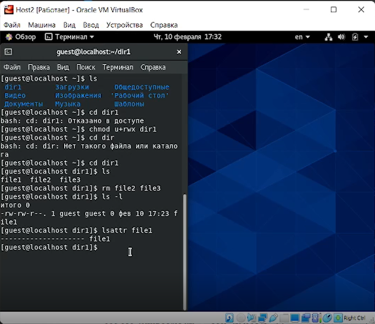
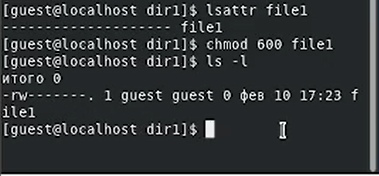
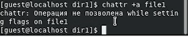
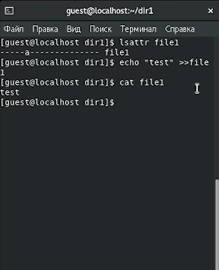
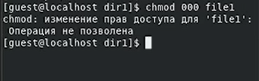
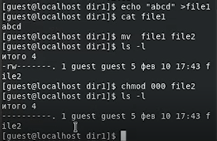

---
## Front matter
lang: ru-RU
title: "Лабораторная работа № 4"
subtitle: "Дискреционное разграничение прав в Linux. Расширенные атрибуты"
author: "Абдуллаев Сайидазизхон Шухратович"

## Formatting
toc: false
slide_level: 2
theme: metropolis
header-includes: 
 - \metroset{progressbar=frametitle,sectionpage=progressbar,numbering=fraction}
 - '\makeatletter'
 - '\beamer@ignorenonframefalse'
 - '\makeatother'
aspectratio: 43
section-titles: true
---

## Цель работы

Получение практических навыков работы в консоли с расширенными атрибутами файлов.

# Ход работы

## Определение расширеннных атрибутов

{ #fig:001 width=100% }

## Установление прав на файл
{ #fig:002 width=100% }

## Установление расширенного атрибута

{ #fig:003 width=100% }

## Дозапись в файл

{ #fig:004 width=100% }

## Изменение прав доступа

{ #fig:005 width=100% }

## Повторение не выполненных ранее действий

{ #fig:006 width=72% }

## Выполнение всех действий после установления расширенного атрибута i.

{ #fig:007 width=100% }

## Вывод

- В результате выполнения данной работы были приобретены практические навыки работы в консоли с расширенными атрибутами файлов.