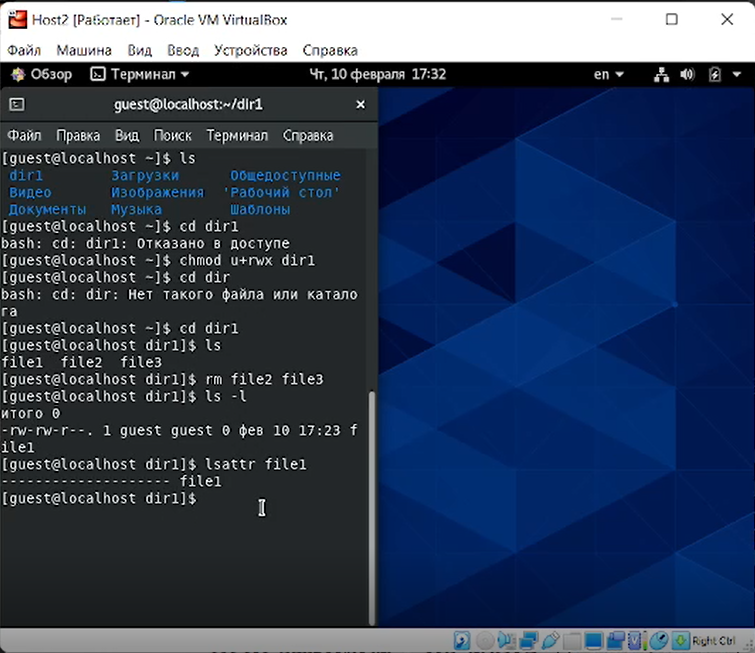
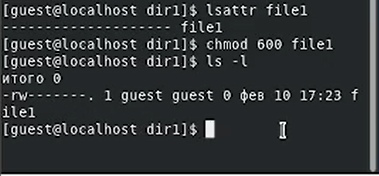
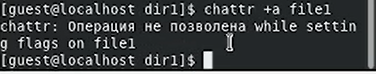
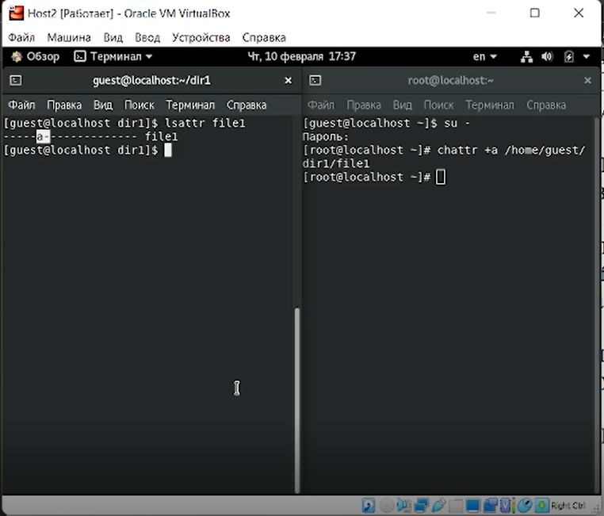
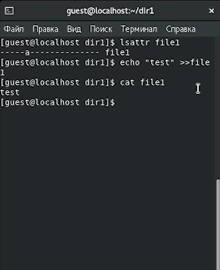
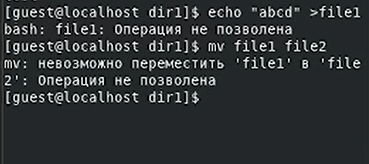
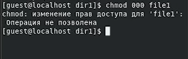
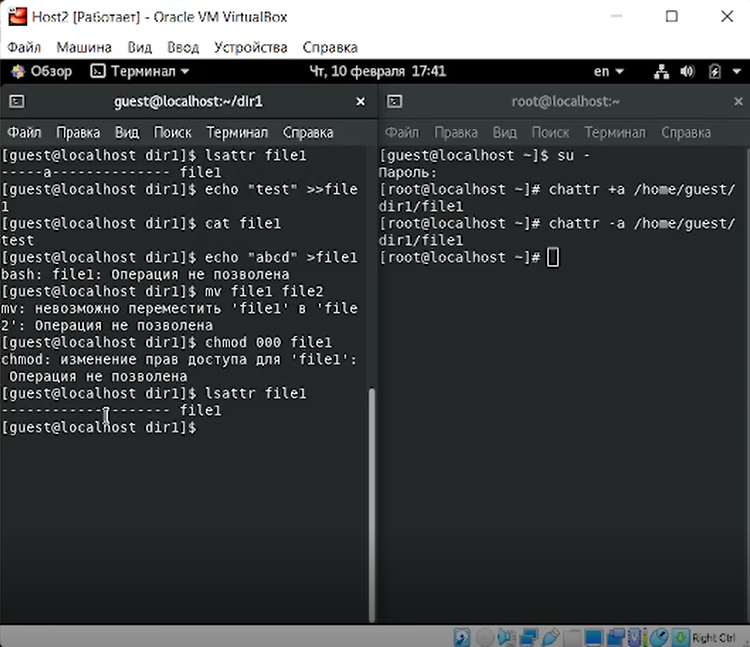
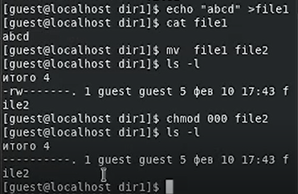
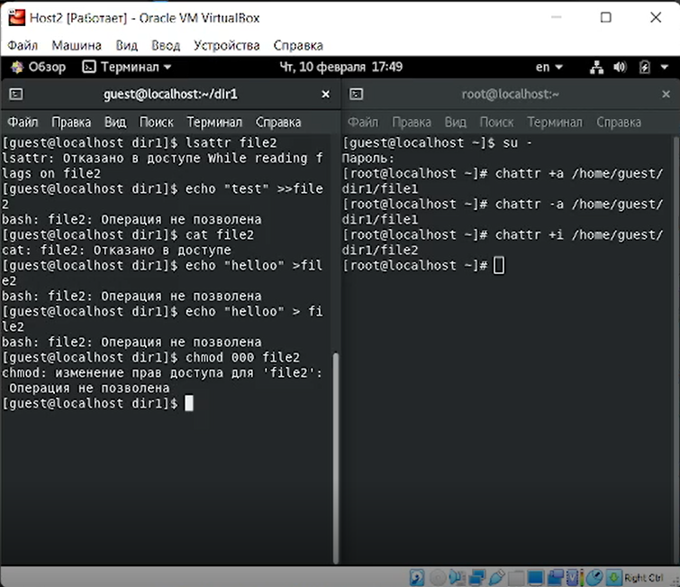

---
# Front matter
lang: ru-RU
title: "Лабораторная работа № 4"
subtitle: "Дискреционное разграничение прав в Linux. Расширенные атрибуты"
author: "Абдуллаев Сайидазизхон Шухратович"

# Formatting
toc-title: "Содержание"
toc: true
toc_depth: 2
lof: true
lot: true
fontsize: 12pt
linestretch: 1.5
papersize: a4paper
documentclass: scrreprt
polyglossia-lang: russian
polyglossia-otherlangs: english
mainfont: PT Serif
romanfont: PT Serif
sansfont: PT Sans
monofont: PT Mono
mainfontoptions: Ligatures=TeX
romanfontoptions: Ligatures=TeX
sansfontoptions: Ligatures=TeX,Scale=MatchLowercase
monofontoptions: Scale=MatchLowercase
indent: true
pdf-engine: lualatex
header-includes:
  - \linepenalty=10
  - \interlinepenalty=0
  - \hyphenpenalty=50
  - \exhyphenpenalty=50
  - \binoppenalty=700
  - \relpenalty=500
  - \clubpenalty=150
  - \widowpenalty=150
  - \displaywidowpenalty=50
  - \brokenpenalty=100
  - \predisplaypenalty=10000
  - \postdisplaypenalty=0
  - \floatingpenalty = 20000
  - \raggedbottom
  - \usepackage{float}
  - \floatplacement{figure}{H}
---

# Цель работы

Получение практических навыков работы в консоли с расширенными атрибутами файлов.

# Задание

Закрепить дискреционное разграничение прав в Linux с расширенными атрибутами.

# Теоретическое введение

В Linux, как и в любой многопользовательской системе, абсолютно естественным образом возникает задача разграничения доступа субъектов — пользователей к объектам — файлам дерева каталогов. Один из подходов к разграничению доступа — так называемый дискреционный - предполагает назначение владельцев объектов, которые по собственному усмотрению определяют права доступа субъектов (других пользователей) к объектам (файлам), которыми владеют. Дискреционные механизмы разграничения доступа используются для разграничения прав доступа процессов как обычных пользователей, так и для ограничения прав системных программ в (например, служб операционной системы), которые работают от лица псевдопользовательских учетных записей. Чтобы получить доступ к файлам в Linux, используются разрешения. Эти разрешения назначаются трем объектам: файлу, группе и другому объекту. Для управления правами используется команда chmod. При использовании chmod в относительном режиме вы работаете с тремя индикаторами, чтобы указать, что вы хотите сделать. Сначала вы указываете, для кого вы хотите изменить разрешения. Для этого вы можете выбрать между пользователем (u), группой (g) и другими (o). Затем вы используете оператор для добавления или удаления разрешений из текущего режима или устанавливаете их абсолютно. В конце вы используете r(read), w(write) и x(execute), чтобы указать, какие разрешения вы хотите установить.При использовании chmod вы можете устанавливать разрешения для пользователя (user), группы (group) и других (other).Помимо основных разрешений, о которых вы только что прочитали, в Linux также есть набор расширенных разрешений. Это не те разрешения, которые вы устанавливаете по умолчанию, но иногда они предоставляют полезное дополнение.

# Ход работы

1. Проверим наличие file1  директории dir1, войдя в учетную завпись пользователя guest. Определим расширенные атрибуты файла. (Рис. [-@fig:001]).

{ #fig:001 width=73% }

2. Установим на file1 права, разрешающие чтение и запись для ладельца файла.Проверим правильность выполнения команды. (Рис. [-@fig:002]).

{ #fig:002 width=73% }

3. Попробуем установить на файл file1 расширенный атрибут a от имени пользователя guest. В результате получаем отказ на выполнение данного действия. (Рис. [-@fig:003]).

{ #fig:003 width=73% }

4. С помощью команды su - заходим на второй консоли в учетную запись root . Попробуем установить расширенный атрибут a на файл /home/guest/dir1/file1 от имени суперпользователя, а затем проверяем правильность выполнения от имени guest. (Рис. [-@fig:004]).

{ #fig:004 width=73% }

5. Выполним дозапись в файл file1 слова «test» командой echo "test" /home/guest/dir1/file1 После этого выполним чтение файла file1 командой cat. (Рис. [-@fig:005]).

{ #fig:005 width=73% }

6. Попробуем стереть имеющуюся в файлк информацию командой echo "abcd" > file1, а также переименовать файл. (Рис. [-@fig:006]).

{ #fig:006 width=73% }

7. Попробуем установить на файл file1 права, запрещающие чтение и за-
пись для владельца файла. В результате получаем отказ. (Рис. [-@fig:007]). 

 { #fig:007 width=73% } 

 8. Снимем расширенный атрибут a с файла /home/guest/dirl/file1 от
имени суперпользователя. (Рис. [-@fig:008]).

 { #fig:008 width=73% }

 9. Повторим не выполненные ранее действия. (Рис. [-@fig:009]).

{ #fig:009 width=73% }

10. Заменим атрибут «a» атрибутом «i» от имени супепользователя и выполним все дйствия по шагам. В результате придем к выводу, что никакие действия с файлом не разрешены.. (Рис. [-@fig:010]).

{ #fig:010 width=73% }

# Выводы

В результате выполнения данной работы были практические навыков работы в консоли с расширенными атрибутами файлов.
