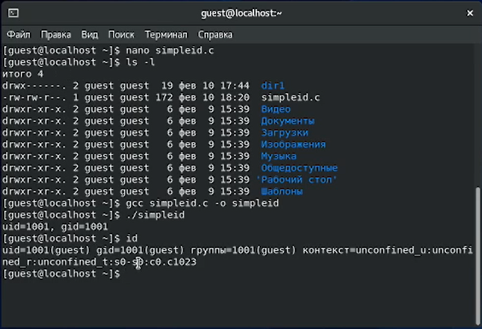
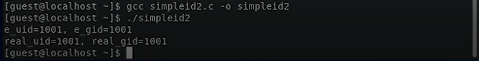
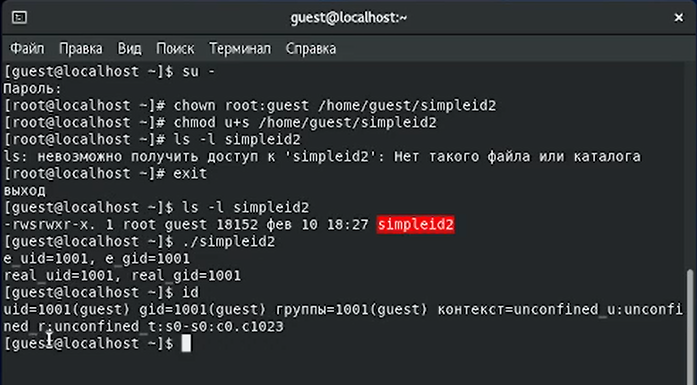
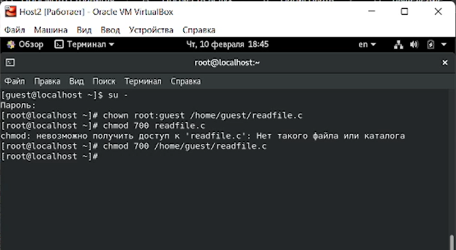
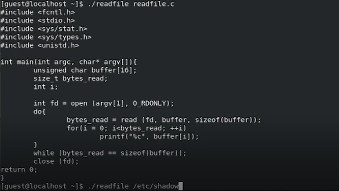
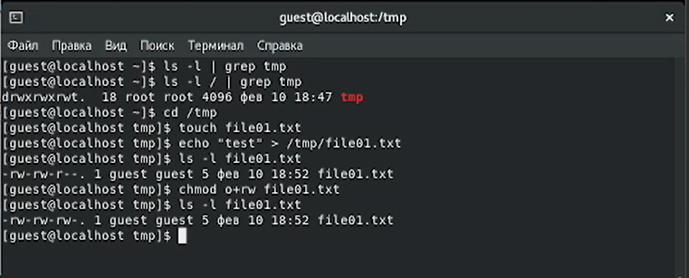
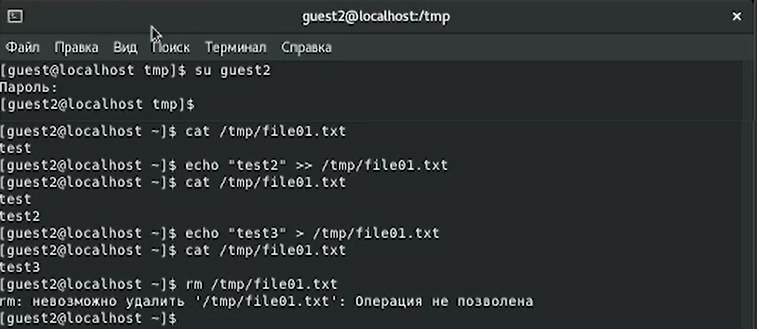

---
## Front matter
lang: ru-RU
title: "Лабораторная работа № 5"
subtitle: "Дискреционное разграничение прав в Linux. Исследование влияния
дополнительных атрибутов"
author: "Абдуллаев Сайидазизхон Шухратович"

## Formatting
toc: false
slide_level: 2
theme: metropolis
header-includes: 
 - \metroset{progressbar=frametitle,sectionpage=progressbar,numbering=fraction}
 - '\makeatletter'
 - '\beamer@ignorenonframefalse'
 - '\makeatother'
aspectratio: 43
section-titles: true
---

## Цель работы

Изучение механизмов изменения идентификаторов, применения SetUID- и Sticky-битов. Получение практических навыков работы в консоли с дополнительными атрибутами. Рассмотрение работы механизма смены идентификатора процессов пользователей, а также влияние бита Sticky на запись и удаление файлов.

# Ход работы

## Написание, запуск и результат работы первой програмы

{ #fig:001 width=100% }

## Написание, запуск и результат работы второй программы
{ #fig:002 width=100% }

## Смена владельца и установление SetUID-бита на программу simpleid2

{ #fig:003 width=100% }

## Установка прав и владельца на программе readfile и файле readfile.c

{ #fig:004 width=100% }

## Чтение файла readfile.c программой readfile

{ #fig:005 width=100% }

## Проверка файла в директории со Sticky-битом

{ #fig:006 width=72% }

## Проверка файла в директории без Sticky-бита

{ #fig:007 width=100% }

## Вывод

- В результате выполнения данной работы были изучены механизмы изменения идентификаторов, применения SetUID- и Sticky-битов. Кроме того, получены практические навыки работы в консоли с дополнительными атрибутами, рассмотрена работа механизма смены идентификатора процессов пользователей, а также влияние бита Sticky на запись и удаление файлов.