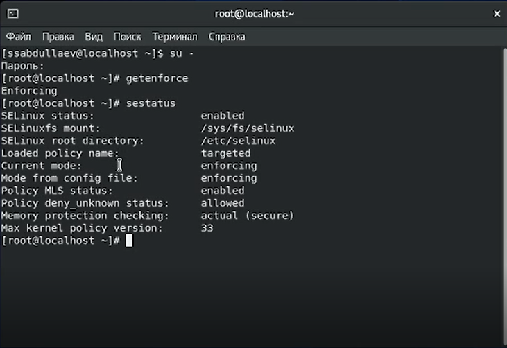
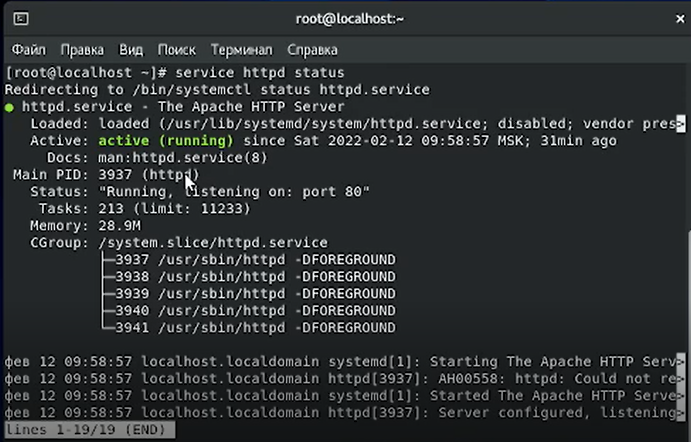
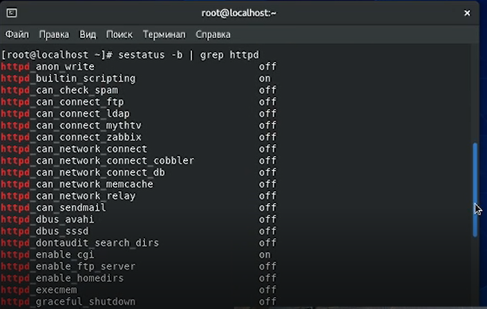
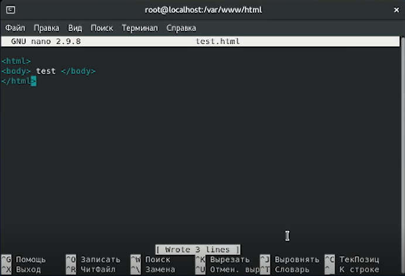
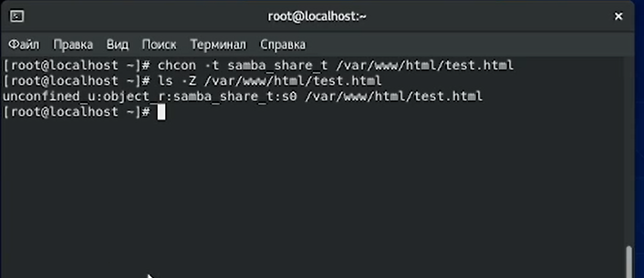
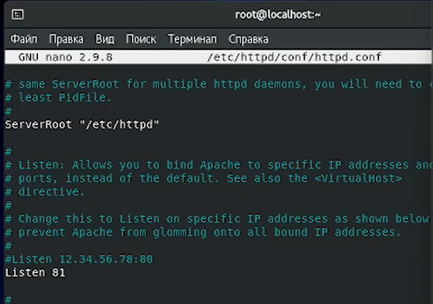
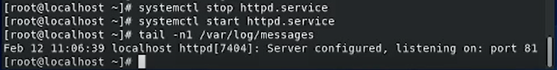

---
## Front matter
lang: ru-RU
title: "Лабораторная работа № 6"
subtitle: "Мандатное разграничение прав в Linux"
author: "Абдуллаев Сайидазизхон Шухратович"

## Formatting
toc: false
slide_level: 2
theme: metropolis
header-includes: 
 - \metroset{progressbar=frametitle,sectionpage=progressbar,numbering=fraction}
 - '\makeatletter'
 - '\beamer@ignorenonframefalse'
 - '\makeatother'
aspectratio: 43
section-titles: true
---

## Цель работы

Развить навыки администрирования ОС Linux.Проверить работу SELinx на практике совместно с веб-сервером Apache..

# Ход работы

## Вход в систему, проверка режима и политики

{ #fig:001 width=100% }

## Проверка работы веб-сервера

{ #fig:002 width=100% }

## Состояние SELinux переключателей

{ #fig:003 width=100% }

## Создание html-файла

{ #fig:004 width=100% }

## Смена контекста файла

{ #fig:005 width=100% }

## Запуск веб-сервера Apache на прослушивание ТСР-порта 81

{ #fig:006 width=72% }

## Перезапуск веб-сервера, анализ log-файлов

{ #fig:007 width=100% }

## Вывод

- В результате выполнения данной работы была изучена технология  SELinux, а также проверена работа  SELinux с веб-сервером Apache.