---
# Front matter
lang: ru-RU
title: "Лабораторная работа № 6"
subtitle: "Мандатное разграничение прав в Linux"
author: "Абдуллаев Сайидазизхон Шухратович"

# Formatting
toc-title: "Содержание"
toc: true
toc_depth: 2
lof: true
lot: true
fontsize: 12pt
linestretch: 1.5
papersize: a4paper
documentclass: scrreprt
polyglossia-lang: russian
polyglossia-otherlangs: english
mainfont: PT Serif
romanfont: PT Serif
sansfont: PT Sans
monofont: PT Mono
mainfontoptions: Ligatures=TeX
romanfontoptions: Ligatures=TeX
sansfontoptions: Ligatures=TeX,Scale=MatchLowercase
monofontoptions: Scale=MatchLowercase
indent: true
pdf-engine: lualatex
header-includes:
  - \linepenalty=10
  - \interlinepenalty=0
  - \hyphenpenalty=50
  - \exhyphenpenalty=50
  - \binoppenalty=700
  - \relpenalty=500
  - \clubpenalty=150
  - \widowpenalty=150
  - \displaywidowpenalty=50
  - \brokenpenalty=100
  - \predisplaypenalty=10000
  - \postdisplaypenalty=0
  - \floatingpenalty = 20000
  - \raggedbottom
  - \usepackage{float}
  - \floatplacement{figure}{H}
---

# Цель работы

Развить навыки администрирования ОС Linux.Проверить работу SELinx на практике совместно с веб-сервером Apache.

# Задание

Получить первое практическое знакомство с технологией SELinux

# Теоретическое введение

Для разграничения доступа субъектов — программ к объектам — файлам дерева каталогов используют так называемый мандатный (от англ, mandatory — обязательный или принудительный) подход (MAC, mandotary access control), предполагающий следование обязательным правилам доступа к файлам, назначаемым администраторами системы. Правила доступа строятся на основе знания о внутреннем устройстве программ и представляют собой описание набора минимально необходимых условий их целевого функционирования. Таким образом, в мандатных правилах, ограничивающих доступ к SSH-ключам пользователя, только программе ssh должен быть разрешен доступ для непосредственного выполнения своих прямых функций, а программам firefox и skype в доступе к SSH-ключам должно быть отказано.

# Ход работы

1. Входим в систему и убеждаемся, что SELinux работает в режиме enforcing политики targeted. (Рис. [-@fig:001]).

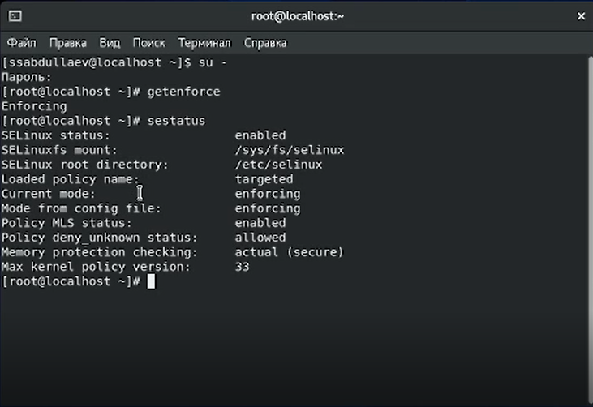{ #fig:001 width=73% }

2. Проверяем работу веб-сервера. (Рис. [-@fig:002]).

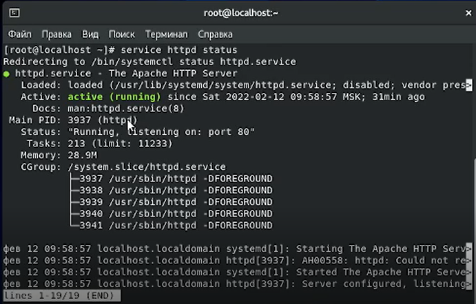{ #fig:002 width=73% }

3. Определяем контекст безопасности веб-сервера.(Рис. [-@fig:003]).

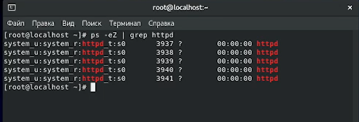{ #fig:003 width=73% }

4. Теперь посмотрим текущее состояние SELinux переключателей. Как можно заметить, практически все переключатели выключены. (Рис. [-@fig:004]).

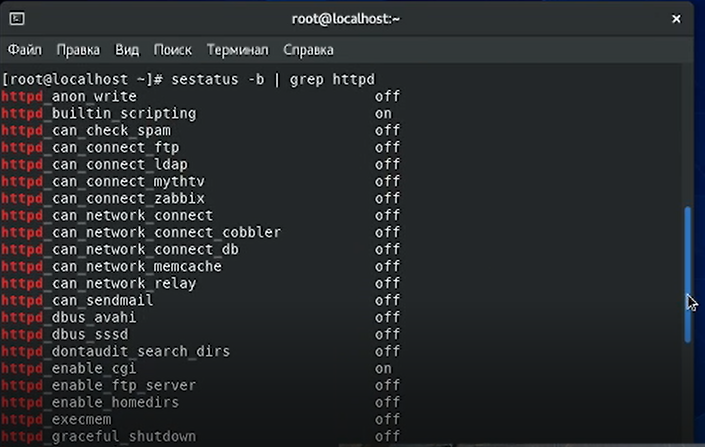{ #fig:004 width=73% }

5. Посмотрели статистику по политике. Кроме того, определили множество польхователей, ролей, типов (Рис. [-@fig:005]).

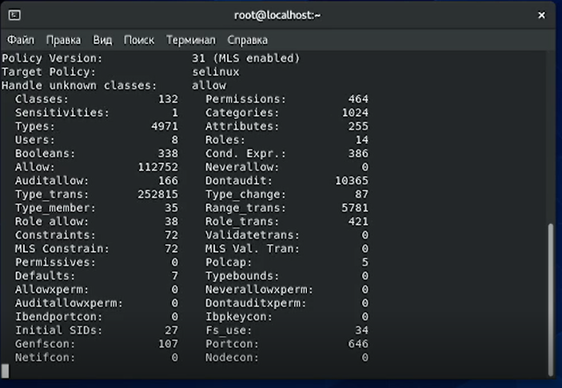{ #fig:005 width=73% }

6.Определили тип файлов и поддиректорий, находящихся в директории /var/www. Тип файлов, находящихся в директории /var/www/html, определить не удалось, т.к. директория не сожержит файлов. Кроме того, определили круг пользователей, которым разрешено создание файлов в данной директории. Оказалось, что только суперпользователь имеет такое право. (Рис. [-@fig:006]).

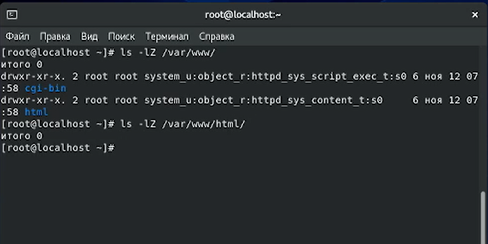{ #fig:006 width=73% }

7. Создали от имени суперпользователя html-файл. (Рис. [-@fig:007]).

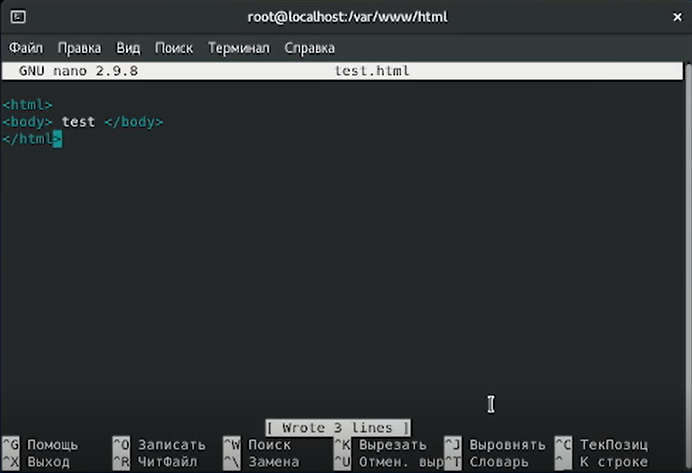{ #fig:007 width=73% }

 8. Проверили контекст созданного файла и обратились к файлу через веб-сервер (Рис. [-@fig:008], -@fig:009]).

 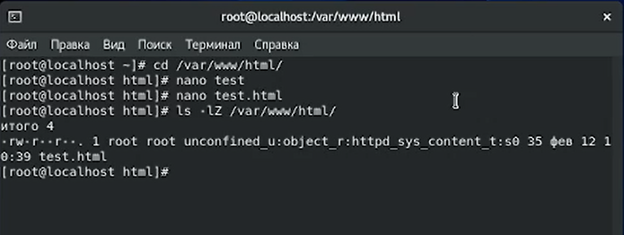{ #fig:008 width=73 }

 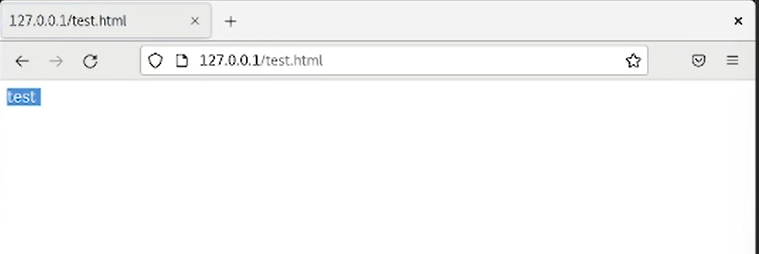{ #fig:009 width=73% }

 9. Изучили справку man httpd_selinux и сопоставили их с типом файла test. (Рис. [-@fig:010]).

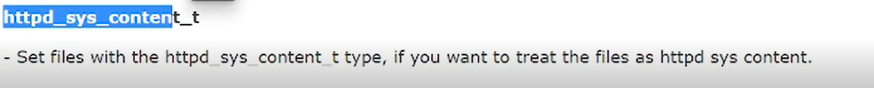{ #fig:010 width=73% }

10. Изменили контекст файла на samba_share_t и проверили, что контекст поменялся. После этого в браузере получили сообщение об ошибке. Это произошло, поскольку SELinux запретил доступ к файлу (Рис. [-@fig:011], [-@fig:012]).

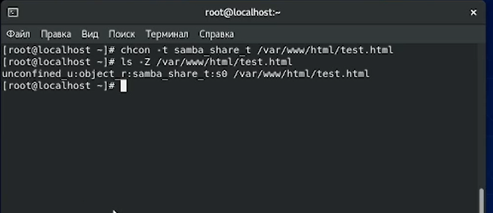{ #fig:011 width=73% }

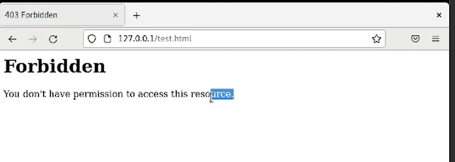{ #fig:012 width=73% }

11. Запустили веб-сервер Apache на прослушивание ТСР-порта 81. После чего перезапустили веб-сервер и проанализировали log-файлы. Также проверили список портов (Рис. [-@fig:013], [-@fig:014]).

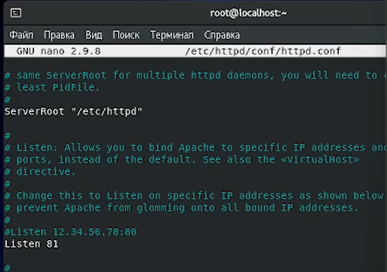{ #fig:013 width=73% }

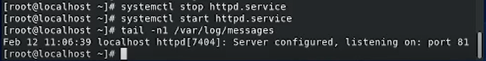{ #fig:014 width=73% }

12. Снова запустили веб-сервер Apache и вернули контекст httpd_sys_cоntent__t к файлу, а затем попробовали получить доступ к файлу через браузер. В результате увидели содержимое файла (Рис. [-@fig:015], [-@fig:016]).  

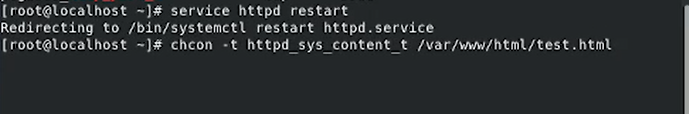{ #fig:015 width=73% }

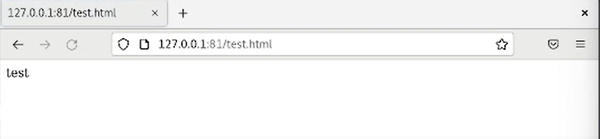{ #fig:016 width=73% }

13. Исправили обратно конфигурационный файл apache, вернув Listen 80 и попытались удалите привязку http_port_t к 81 порту. Вылезла ошибка, поскольку порт 81 определен на уровне политики. После этого удилили html-файл (Рис. [-@fig:017], [-@fig:018]).  

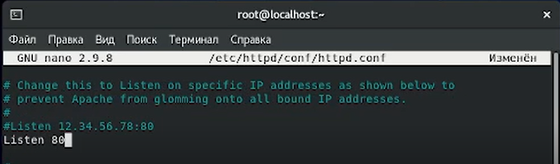{ #fig:017 width=73% }

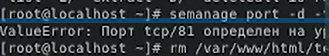{ #fig:018 width=73% }

# Выводы

В результате выполнения данной работы была изучена технология  SELinux, а также проверена работа  SELinux с веб-сервером Apache.
