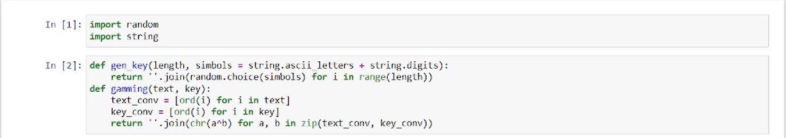
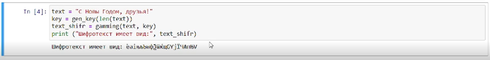
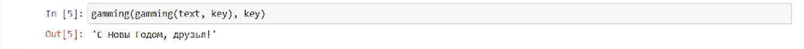
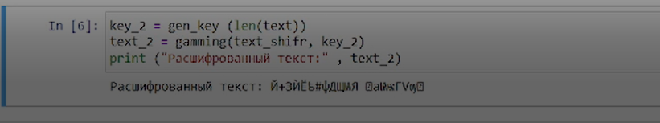

---
## Front matter
lang: ru-RU
title: "Лабораторная работа № 7"
subtitle: "Элементы криптографии. Однократное гаммирование"
author: "Абдуллаев Сайидазизхон Шухратович"

## Formatting
toc: false
slide_level: 2
theme: metropolis
header-includes: 
 - \metroset{progressbar=frametitle,sectionpage=progressbar,numbering=fraction}
 - '\makeatletter'
 - '\beamer@ignorenonframefalse'
 - '\makeatother'
aspectratio: 43
section-titles: true
---

## Цель работы

Освоить на практике применение режима однократного гаммирования

# Ход работы

## Импорт библиотек и написание функций

{ #fig:001 width=100% }

## Шифрование открытого текста

{ #fig:002 width=100% }

## Проверка правильности работы кода

{ #fig:003 width=100% }

## Расшифровка зашифрованного текста новым ключом

{ #fig:004 width=100% }

## Вывод

- В результате выполнения данной работы было освоено на практике применение режима однократного гаммирования
