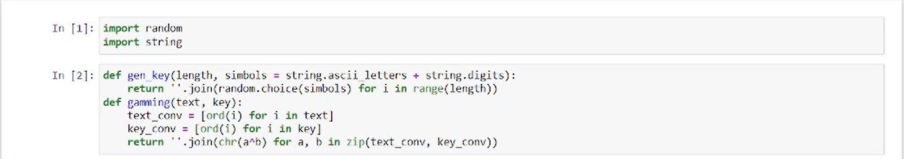
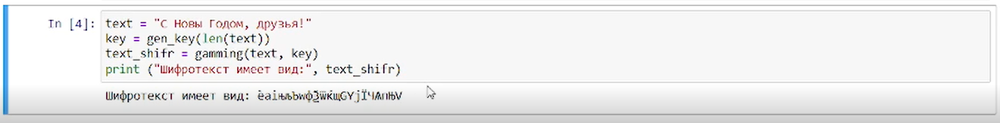

---
# Front matter
lang: ru-RU
title: "Лабораторная работа № 7"
subtitle: "Элементы криптографии. Однократное гаммирование"
author: "Абдуллаев Сайидазизхон Шухратович"

# Formatting
toc-title: "Содержание"
toc: true
toc_depth: 2
lof: true
lot: true
fontsize: 12pt
linestretch: 1.5
papersize: a4paper
documentclass: scrreprt
polyglossia-lang: russian
polyglossia-otherlangs: english
mainfont: PT Serif
romanfont: PT Serif
sansfont: PT Sans
monofont: PT Mono
mainfontoptions: Ligatures=TeX
romanfontoptions: Ligatures=TeX
sansfontoptions: Ligatures=TeX,Scale=MatchLowercase
monofontoptions: Scale=MatchLowercase
indent: true
pdf-engine: lualatex
header-includes:
  - \linepenalty=10
  - \interlinepenalty=0
  - \hyphenpenalty=50
  - \exhyphenpenalty=50
  - \binoppenalty=700
  - \relpenalty=500
  - \clubpenalty=150
  - \widowpenalty=150
  - \displaywidowpenalty=50
  - \brokenpenalty=100
  - \predisplaypenalty=10000
  - \postdisplaypenalty=0
  - \floatingpenalty = 20000
  - \raggedbottom
  - \usepackage{float}
  - \floatplacement{figure}{H}
---

# Цель работы

Освоить на практике применение режима однократного гаммирования

# Задание

1.Определить вид шифротекста при известном ключе и известном открытом тексте. 2. Определить ключ, с помощью которого шифротекст может быть преобразован в некоторый фрагмент текста, представляющий собой один из возможных вариантов прочтения открытого текста

# Теоретическое введение

С точки зрения теории криптоанализа, метод шифрования однократной случайной равновероятной гаммой той же длины, что и открытый текст, является невскрываемым (далее для краткости авторы будут употреблять термин "однократное гаммирование", держа в уме все вышесказанное). Обоснование, которое привел Шеннон, основываясь на введенном им же понятии информации, не дает возможности усомниться в этом - из-за равных априорных вероятностей криптоаналитик не может сказать о дешифровке, верна она или нет. Кроме того, даже раскрыв часть сообщения, дешифровщик не сможет хоть сколько нибудь поправить положение - информация о вскрытом участке гаммы не дает информации об остальных ее частях.

# Ход работы

1. Импортируем все необходимые библиотеки и пишем функцию генерирования ключа, а также функцию гаммирования. (Рис. [-@fig:001]).

{ #fig:001 width=73% }

2.  Определяем вид шифротекста при известном ключе и известном открытом тексте. (Рис. [-@fig:002]).

{ #fig:002 width=73% }

3. Применяем функцию "gamming" к полученному шифру и ключу, чтобы провериьь правильность работы программы. В результате снова получаем исходный текст (Рис. [-@fig:003]).

{ #fig:003 width=73% }

4. Определяем ключ, с помощью которого шифротекст может быть преобразован в некоторый фрагмент текста, представляющий собой один из
возможных вариантов прочтения открытого текста. (Рис. [-@fig:004]).

{ #fig:004 width=73% }

# Ответы на котнрольные вопросы

1. Гаммирование – это наложение (снятие) на открытые (зашифрованные) данные криптографической гаммы, то есть последовательности элементов данных, вырабатываемых с помощью некоторого криптографического алгоритма, для получения зашифрованных (открытых) данных. Однократное гаммирование – это когда каждый символ попарно с символом ключа складываются по модулю 2 (XOR) (обозначается знаком $\oplus$).

2. Недостатки: Размер ключевого материала должен совпадать с размером передаваемых сообщений. Кроме того, если одну и ту же гамму использовать дважды для разных сообщений, то шифр из совершенно стойкого превращается в «совершенно нестойкий» и допускает дешифрование практически вручную.

3. Преимущества: Метод шифрования случайной однократной равновероятной гаммой той же длины, что и открытый текст, является невскрываемым. Кроме того, даже раскрыв часть сообщения, дешифровщик не сможет хоть сколько-нибудь поправить положение - информация о вскрытом участке гаммы не дает информации об остальных ее частях. К достоинствам также можно отнести простоту реализации и удобство применения. 

4. Потому что каждый символ открытого текста должен складываться с символом ключа попарно.

5. В режиме однократного гаммирования используется сложение по модулю 2 (XOR) между элементами гаммы и элементами подлежащего сокрытию текста. Особенность заключается в том, что этот алгоритм шифрования является симметричным. Поскольку двойное прибавление одной и той же величины по модулю 2 восстанавливает исходное значение, шифрование и расшифрование выполняется одной и той же программой.

6. Сложить по модулю 2 каждый символ открытого текста и ключа

7. Сложить по модулю 2 каждый символ открытого текста и шифротекста.

8. Необходимые и достаточные условия абсолютной стойкости шифра:
   Полная случайность ключа;
   Равенство длин ключа и открытого текста;
   Однократное использование ключа.

# Выводы

В результате выполнения данной работы было освоено на практике применение режима однократного гаммирования
