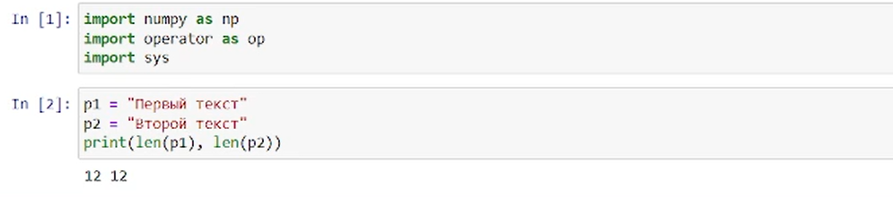
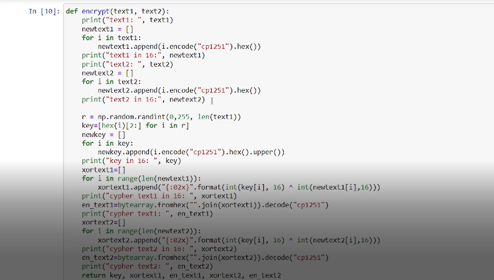
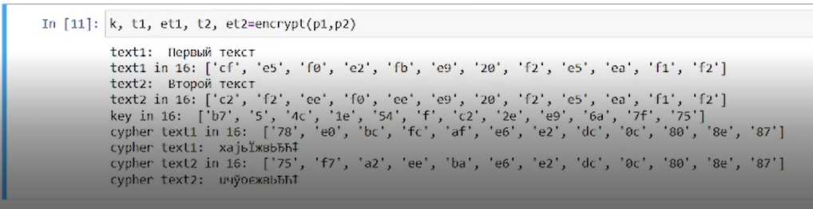
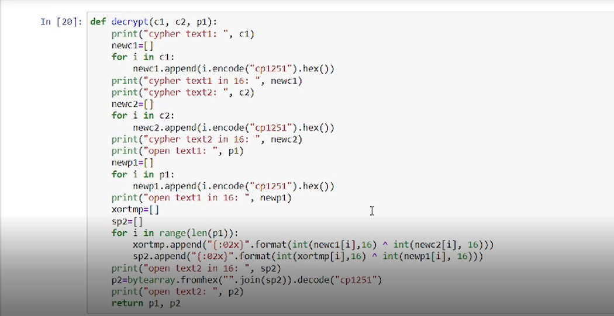
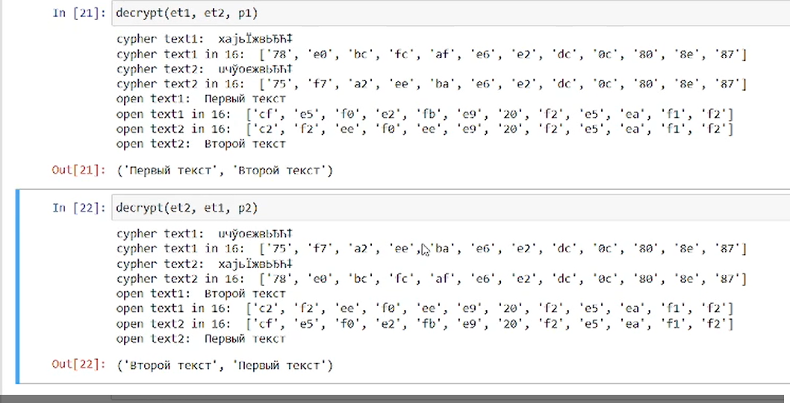

---
## Front matter
lang: ru-RU
title: "Лабораторная работа № 8"
subtitle: "Элементы криптографии. Шифрование (кодирование) различных исходных текстов одним ключом."
author: "Абдуллаев Сайидазизхон Шухратович"

## Formatting
toc: false
slide_level: 2
theme: metropolis
header-includes: 
 - \metroset{progressbar=frametitle,sectionpage=progressbar,numbering=fraction}
 - '\makeatletter'
 - '\beamer@ignorenonframefalse'
 - '\makeatother'
aspectratio: 43
section-titles: true
---

## Цель работы

Освоить на практике применение режима однократного гаммирования на примере кодирования различных исходных текстов одним ключом.

# Ход работы

## Импорт библиотек и два текста одинаковой длины

{ #fig:001 width=100% }

## Функция определяющая вид шифротекстов С1 и С2 при известном ключе

{ #fig:002 width=100% }

## Вывод функции:

{ #fig:003 width=100% }

## Новая функция:

Написал функцию, которая при известных двух шифротекстах и одном открытом тексте находит вид второго открытого текста без ключа. 

{ #fig:004 width=100% }

## Вывод функции:
{ #fig:004 width=100% }

## Вывод

- Освоил на практике применение режима однократного гаммирования на примере кодирования различных исходных текстов одним ключом.
